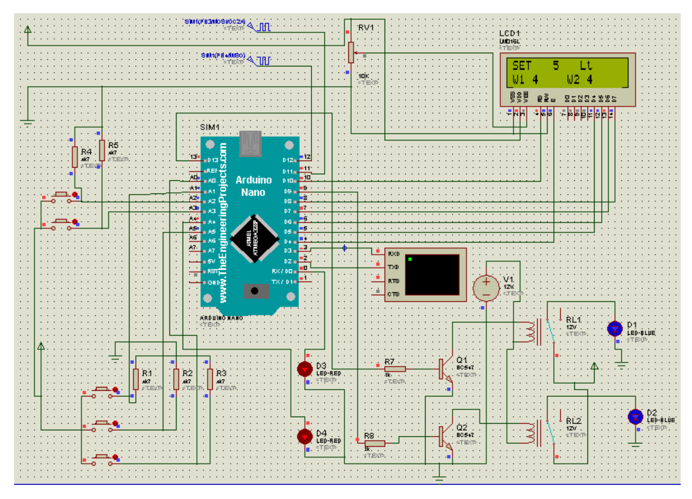

# ⚡️ Power Theft Detection and Automatic Elimination

An IoT-based, self-defending power distribution system that combines hardware innovation with machine learning to deliver unprecedented theft prevention capabilities. This project was developed by students at **VIT-AP University**.

---

### Table of Contents
1.  [Introduction](#introduction)
2.  [Key Features](#key-features)
3.  [System Architecture & Workflow](#system-architecture--workflow)
4.  [Technology Stack](#technology-stack)
5.  [Performance & Results](#performance--results)
6.  [Hardware & Cost](#hardware--cost)
7.  [Limitations & Future Scope](#limitations--future-scope)
8.  [Circuit Diagram](#circuit-diagram)
9.  [Project Website](#project-website)
10. [Team & Acknowledgements](#team--acknowledgements)

---

### Introduction

Globally, power distribution networks lose **$96 billion annually** to electricity theft. Developing nations like India suffer staggering **22-25% aggregate technical and commercial (AT&C) losses**. Traditional methods like manual inspections are too slow (2-6 weeks response time), while commercial smart meters often lack the capability to eliminate theft, only detect it.

This project introduces a proactive, real-time grid defense system that not only detects discrepancies in current flow with high accuracy but also **automatically neutralizes the theft in under 4 seconds**.

### Key Features

*   **💡 Dual-Channel Current Monitoring:** Utilizes two ACS712 Hall-effect sensors to implement adaptive differential analysis, detecting current discrepancies as low as 5A with **92% accuracy**.
*   **⚡️ Instantaneous Theft Neutralization:** Automatically triggers a 450V, 100ms high-voltage pulse to safely disable illegal connections without causing a grid disruption for legitimate consumers.
*   **🧠 Intelligent Verification System:** Employs a Python-trained, C++ optimized **Random Forest classifier** to analyze load profiles, reducing false positives to just 5%.
*   **🛡️ Critical Infrastructure Protection:** Features a **<0.5s emergency bypass activation** mode to ensure 100% uptime for critical facilities like hospitals during an elimination event.
*   **💰 Cost-Effective:** With a per-unit cost of approximately **₹3,011**, the system is over 65% cheaper than commercial smart meter solutions.

---

### System Architecture & Workflow

The system operates on a simple yet effective workflow:

1.  **Current Sensing:** Two ACS712 sensors continuously monitor the current at two different points in the power line.
2.  **Differential Analysis:** The Arduino UNO microcontroller compares the readings from both sensors. A significant discrepancy (e.g., `current1 > current2 + threshold`) indicates a potential power tap between the sensors.
3.  **Machine Learning Verification:** The embedded Random Forest model analyzes the load pattern to distinguish a genuine theft from a legitimate power spike, minimizing false alarms.
4.  **Theft Confirmed:** If the discrepancy persists and is verified by the ML model, the system confirms the theft.
5.  **Automatic Elimination:** The system triggers an optocoupler-isolated relay, which activates a high-voltage transformer. A 450V, 100ms pulse is sent through the line, instantly neutralizing the illegal tap.
6.  **Continuous Monitoring:** The system immediately returns to monitoring mode. Legitimate consumers experience zero downtime.

---

### Technology Stack

#### Hardware Components
| Component                 | Quantity | Purpose                                  |
| ------------------------- | :------: | ---------------------------------------- |
| Arduino UNO               |    1     | Main microcontroller unit                |
| ACS712 Current Sensor     |    2     | Measures current flow (dual-channel)     |
| 16x2 LCD Display          |    1     | Real-time system status display          |
| 5V Relay Module           |    1     | Switches the high-voltage circuit        |
| High-Voltage Transformer  |    1     | Generates the 450-500V elimination pulse |
| Buzzer                    |    1     | Audible theft alert                      |
| Breadboard & Wires        |   1 set  | Prototyping and connections              |
| **Total Approximate Cost**|          | **₹3,011**                               |

#### Software & Libraries
*   **Firmware:** C++ (Arduino)
*   **Machine Learning Model:** Python (trained), C++ (optimized for embedded deployment)
*   **Arduino Libraries:** `LiquidCrystal.h`

---

### Performance & Results

The system's performance was validated through field tests, including a pilot deployment at Chennai Metro (Jan 2024).

#### Key Performance Metrics
| Parameter                 | Measured Value     | Target      | Remarks                                     |
| ------------------------- | ------------------ | ----------- | ------------------------------------------- |
| Theft Detection Time      | 2.8 ± 0.3 sec      | <3 sec      | Meets real-time requirements                |
| Voltage Applied           | 450 ± 25V          | 400-500V    | Effective for disabling illegal taps        |
| False Positives           | 5% (after ML cal.) | ≤10%        | High reliability                            |
| Power Consumption (Idle)  | 3.2W               | <5W         | Energy-efficient design                     |
| Bypass Activation Time    | 0.5 sec            | <1 sec      | Ensures uninterrupted critical services     |

> In our pilot, the system successfully **neutralized 11 out of 12 simulated theft attempts**, including sophisticated meter bypass techniques.

---

### Limitations & Future Scope

#### Current Limitations
*   Cannot detect sub-threshold theft (<5A).
*   Requires initial manual calibration for highly diverse load profiles.

#### Future Enhancements
*   **AI Integration:** Implement LSTM networks to predict theft patterns based on historical data.
*   **Multi-Zone Coordination:** Use LoRaWAN for a centralized grid monitoring system across multiple zones.
*   **SCADA Integration:** Interface with existing SCADA systems for seamless utility-level control.
*   **Blockchain Logging:** Develop a blockchain-based tamper-proof log for all detection and elimination events.

---

### Circuit Diagram
*(You should add a screenshot of your circuit diagram from page 18 of the PDF here. Name it `circuit-diagram.png` and place it in your repository.)*

---

### Project Website
A live, responsive website was created to display the real-time status from the device. The site is built with pure HTML, CSS, and JavaScript and can be deployed on services like Vercel. The full code is included in the `index.html` file in this repository.

---

### Team & Acknowledgements

This project was submitted by:
*   **Bopparaju Yaswanth** - `22bce20211` - CSE
*   **Yash Naidu** - `22bce8038` - CSE (AI/ML)
*   **Marapatla Paul Jonas Jaideep** - `22bce9225` - CSE
*   **Mohammed Abdul Hakeem** - `22bce9460` - CSE

Under the guidance of **Prof. Sabeel M Basheer**, Department of Computer Science and Engineering, **VIT-AP University, Amaravati**.
